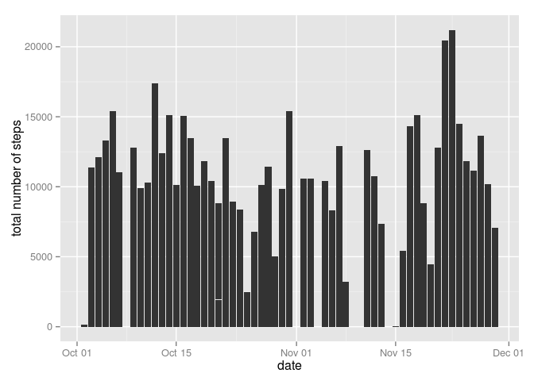
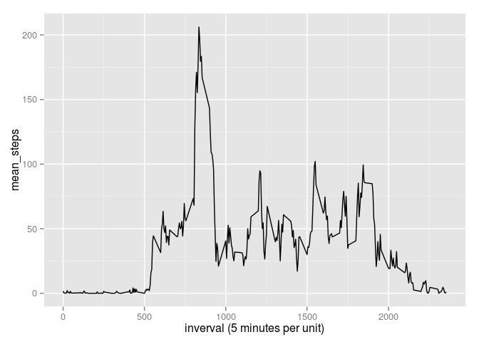
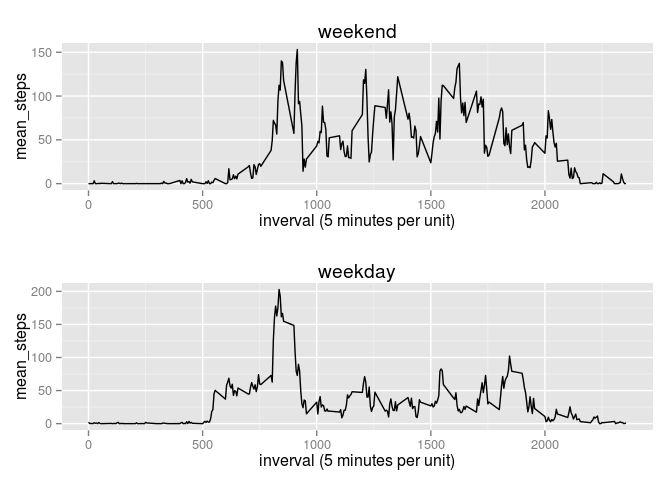

# Reproducible Research: Peer Assessment 1


## Loading and preprocessing the data

```r
options("scipen"=10)
#set high penalty for scientific number display
library("lubridate")
work <- read.csv("activity.csv")
work$date <- ymd(work$date)
```
## What is mean total number of steps taken per day?

```r
library("dplyr")
```

```
## 
## Attaching package: 'dplyr'
## 
## The following objects are masked from 'package:lubridate':
## 
##     intersect, setdiff, union
## 
## The following object is masked from 'package:stats':
## 
##     filter
## 
## The following objects are masked from 'package:base':
## 
##     intersect, setdiff, setequal, union
```

```r
library("ggplot2")
ggplot(work, aes(x=date, y = steps)) + geom_histogram(binwidth=.5, stat="identity") + ylab("total number of steps")
```

```
## Warning: Removed 2304 rows containing missing values (position_stack).
```

 

```r
work_tbl <- tbl_df(work)
by_date <- group_by(work_tbl, date)
total_steps_by_date <- summarise(by_date, total_steps = sum(steps))
total_steps_mean <- mean(total_steps_by_date$total_steps, na.rm=TRUE)
total_steps_median <- median(total_steps_by_date$total_steps, na.rm=TRUE)
```

the mean total number of steps taken per day is 10766.1886792.

the median total number of steps taken per day is 10765.
 
## What is the average daily activity pattern?

```r
library("dplyr")
library("ggplot2")

by_interval <- group_by(work_tbl, interval)
mean_steps_by_interval <- summarise(by_interval, mean_steps = mean(steps, na.rm=TRUE))

ggplot(mean_steps_by_interval, aes(x= interval, y= mean_steps)) + geom_line()+ xlab("inverval (5 minutes per unit)")
```

 

```r
# draw a time series plot of the 5-minute interval (x-axis) and the average number of steps taken, averaged across all days (y-axis)

arrange_mean <- arrange(mean_steps_by_interval, desc(mean_steps))
#
```
"835"is the interval, on average across all the days in the dataset, contains the maximum number of steps.

## Imputing missing values

```r
total_na <- sum(is.na(work$steps))
```
The total number of missing values in the dataset is 2304.

```r
na_in_work <-
    work %>% 
        group_by(date) %>%
        mutate(steps= replace(steps, is.na(steps), mean(steps, na.rm=TRUE))) %>%
        #replace na with the average steps of that date.
        mutate(steps= replace(steps, is.nan(steps), 0))
        #replace NaN with 0

ggplot(na_in_work, aes(x=date, y = steps)) + geom_histogram(binwidth=.5, stat="identity") + ylab("total number of steps")
```

 

```r
by_date <- group_by(na_in_work, date)
total_steps_by_date <- summarise(by_date, total_steps = sum(steps))
total_steps_mean_n <- mean(total_steps_by_date$total_steps)
total_steps_median_n <- median(total_steps_by_date$total_steps)
```
The mean total number of steps taken per day is 9354.2295082

The median total number of steps taken per day is 10395

Yes, the mean and the median differ from the estimates from the first part of the assignment.

I try to use the mean of that day to fill the NA, but because the NA exist in whole-day way, I decide to fill them by using number zero, or I will get NaN.

## Are there differences in activity patterns between weekdays and weekends?

```r
weekday_work <-
    na_in_work %>%
        mutate(weekdayn = wday(date)) %>%
        #find out which week day
        mutate(weekday = ifelse(weekdayn == 1 | weekdayn == 7, "weekend", "weekday"))
        #if saturday or sunday, it's weekend, else it's weekday.


weekday_work_d <- filter(weekday_work, weekday == "weekday")
weekend_work_d <- filter(weekday_work, weekday == "weekend")

mean_steps_weekday_n <-
    weekday_work_d %>%
        group_by(interval) %>%
        summarise(mean_steps = mean(steps))

mean_steps_weekend_n <-
    weekend_work_d %>%
        group_by(interval) %>%
        summarise(mean_steps = mean(steps))


plot_weekday <- ggplot(mean_steps_weekday_n, aes(x= interval, y= mean_steps)) + geom_line()+ xlab("inverval (5 minutes per unit)")+labs(title = "weekday")
plot_weekend <- ggplot(mean_steps_weekend_n, aes(x= interval, y= mean_steps)) + geom_line()+ xlab("inverval (5 minutes per unit)") + labs(title = "weekend")

library(grid)
pushViewport(viewport(layout = grid.layout(2, 1)))
print(plot_weekday, vp = viewport(layout.pos.row = 2, layout.pos.col = 1))
print(plot_weekend, vp = viewport(layout.pos.row = 1, layout.pos.col = 1))
```

 

By seeing the plot, there are differences in activity patterns between weekdays and weekends
